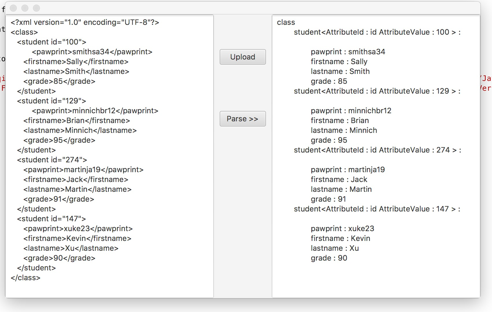
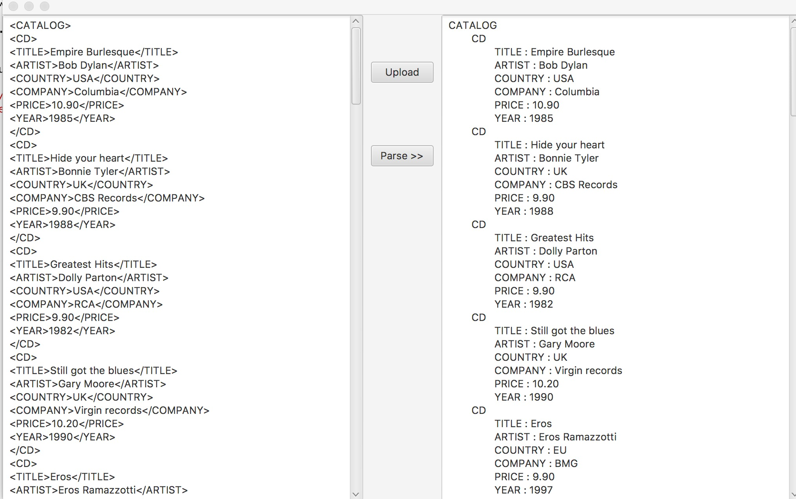

# Java-SAX-Parser-to-Create-DOM

## Description:
 Using the Java SAX parser (event-based parser), create a Document Object Model (DOM/graph/tree) representation of the data contained in an XML document. The resulting DOM is to contain all the data that is provided in the XML document and should work for any XML document structure. The parser is to be a static method on a class that is appropriately named. The parser is throw exceptions if it encounters a problem. A test application is to be created that uses JavaFX to select an XML file to open and parse and then display the resulting DOM.

## Purpose:
 Gain experience with XML and using the JAVA SAX parser to create a Document Object Model (DOM).

## Requirements:

**Target Platform:** Java 8 / JavaFX

**Programming Language:** Java 8 

**UI:** JavaFX

**IDE:** NetBeans 8.2

This project is to be managed in a public GitHub repository. For the challenge assignment submit the URL for the repository. The final project work is to be in the master branch.
Using the Java SAX parser (event-based parser), create a Document Object Model (DOM/directed graph/tree) representation of the data contained in an XML document. The resulting DOM is to contain all the data that is provided in the XML document and should work for any XML document structure. The parser is to be a static method on a class that is appropriately named. The parser is to throw exceptions if problems are encountered.
To test the parser, create a test application that allows the user to use the File Open dialog to select an XML file that is to be parsed and turned into a DOM. After the DOM is created from the XML, the contents of the DOM are to be displayed in the UI. How you display the DOM information is up to you. But, whatever presentation you use should show the contents of the DOM in a way that the user can see the parser works.

## Result
* Test with class example [course1.xml](course1.xml)

* Test with xml downloaded online [example.xml](example.xml)
w3school
[original link](https://www.w3schools.com/xml/cd_catalog.xml)

